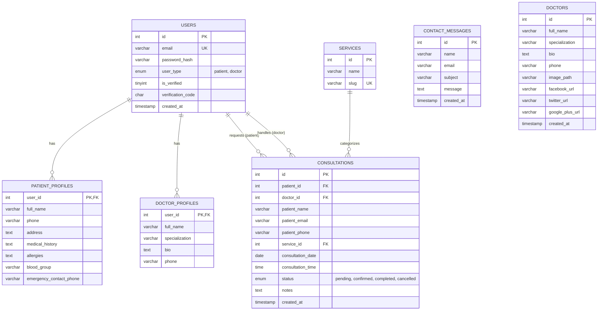

# FIGURE 2.29: Entity-Relationship Diagram for Medicate

## Complete Database Schema and Relationships



---

## Table Descriptions

### USERS Table
**Purpose:** Central authentication table for all system users (patients and doctors)

**Key Fields:**
- `id`: Primary key, auto-increment
- `email`: Unique email address for login
- `password_hash`: Bcrypt hashed password
- `user_type`: Enum distinguishing between 'patient' and 'doctor'
- `is_verified`: Boolean flag for email verification status
- `verification_code`: 6-digit code for email verification

**Relationships:**
- One-to-One with `PATIENT_PROFILES` (when user_type = 'patient')
- One-to-One with `DOCTOR_PROFILES` (when user_type = 'doctor')
- One-to-Many with `CONSULTATIONS` as patient
- One-to-Many with `CONSULTATIONS` as doctor

---

### PATIENT_PROFILES Table
**Purpose:** Extended information for patient users

**Key Fields:**
- `user_id`: Foreign key to USERS table (Primary Key)
- `full_name`: Patient's full name
- `medical_history`: Past medical conditions
- `allergies`: Known allergies
- `blood_group`: Blood type (A+, O-, etc.)
- `emergency_contact_phone`: Emergency contact number

**Relationships:**
- Many-to-One with `USERS`

---

### DOCTOR_PROFILES Table
**Purpose:** Extended professional information for doctor users

**Key Fields:**
- `user_id`: Foreign key to USERS table (Primary Key)
- `full_name`: Doctor's full name
- `specialization`: Medical specialization (e.g., Cardiology, Neurology)
- `bio`: Professional biography
- `phone`: Contact phone number

**Relationships:**
- Many-to-One with `USERS`

---

### SERVICES Table
**Purpose:** Medical services catalog offered by the platform

**Key Fields:**
- `id`: Primary key, auto-increment
- `name`: Service name (e.g., "Cardiology Services")
- `slug`: URL-friendly version (e.g., "cardiology")

**Pre-populated Services:**
1. Angioplasty
2. Cardiology
3. Dental
4. Endocrinology
5. Eye Care
6. Neurology
7. Orthopaedics
8. RMI (Radiology/Medical Imaging)

**Relationships:**
- One-to-Many with `CONSULTATIONS`

---

### CONSULTATIONS Table
**Purpose:** Manages consultation bookings between patients and doctors

**Key Fields:**
- `id`: Primary key, auto-increment
- `patient_id`: Foreign key to USERS (patient)
- `doctor_id`: Foreign key to USERS (doctor) - nullable until assigned
- `service_id`: Foreign key to SERVICES
- `consultation_date`: Scheduled date
- `consultation_time`: Scheduled time
- `status`: Current status (pending → confirmed → completed/cancelled)
- `notes`: Reason for consultation or doctor's notes

**Workflow:**
1. **Pending**: Patient creates consultation request
2. **Confirmed**: Doctor accepts and is assigned to consultation
3. **Completed**: Consultation finished successfully
4. **Cancelled**: Rejected or cancelled by either party

**Relationships:**
- Many-to-One with `USERS` (as patient)
- Many-to-One with `USERS` (as doctor)
- Many-to-One with `SERVICES`

---

### CONTACT_MESSAGES Table
**Purpose:** Stores messages from contact form submissions

**Key Fields:**
- `id`: Primary key, auto-increment
- `name`: Sender's name
- `email`: Sender's email
- `subject`: Message subject (optional)
- `message`: Message content
- `created_at`: Timestamp of submission

**Relationships:**
- Independent table (no foreign keys)

---

### DOCTORS Table
**Purpose:** Static reference table for displaying doctor information on public pages

**Note:** This table appears to be a legacy/static table separate from the dynamic DOCTOR_PROFILES. It may contain sample/placeholder data for the public-facing "Specialists" page.

**Key Fields:**
- `id`: Primary key, auto-increment
- `full_name`: Doctor's name
- `specialization`: Medical specialty
- `image_path`: Path to profile photo
- Social media URLs (Facebook, Twitter, Google+)

**Relationships:**
- Independent table (no foreign keys to USERS)

---

## Key Relationships Explained

### 1. User Authentication Flow
```
USERS (authentication) → PATIENT_PROFILES or DOCTOR_PROFILES (extended info)
```

### 2. Consultation Booking Flow
```
PATIENT (USERS) → creates → CONSULTATION → references → SERVICE
                                ↓
                         assigned to → DOCTOR (USERS)
```

### 3. Profile Retrieval Flow
```
Login → USERS → check user_type → fetch PATIENT_PROFILES or DOCTOR_PROFILES
```

---

## Database Constraints and Integrity

### Primary Keys
- All tables have a primary key (typically `id`)
- `PATIENT_PROFILES` and `DOCTOR_PROFILES` use `user_id` as PK

### Foreign Keys
- **PATIENT_PROFILES.user_id** → USERS.id (CASCADE on delete)
- **DOCTOR_PROFILES.user_id** → USERS.id (CASCADE on delete)
- **CONSULTATIONS.patient_id** → USERS.id (CASCADE on delete)
- **CONSULTATIONS.doctor_id** → USERS.id (SET NULL on delete)
- **CONSULTATIONS.service_id** → SERVICES.id

### Unique Constraints
- **USERS.email** - Ensures no duplicate accounts
- **SERVICES.slug** - Ensures unique URL paths

### Enumerations
- **USERS.user_type**: `'patient'`, `'doctor'`
- **CONSULTATIONS.status**: `'pending'`, `'confirmed'`, `'completed'`, `'cancelled'`

---

## Data Flow Examples

### Example 1: Patient Registration
1. Insert into `USERS` (email, password_hash, user_type='patient', verification_code)
2. Insert into `PATIENT_PROFILES` (user_id, full_name='')
3. User verifies email using verification_code
4. Update `USERS.is_verified = 1`

### Example 2: Consultation Booking
1. Patient selects service from `SERVICES`
2. Insert into `CONSULTATIONS` (patient_id, service_id, consultation_date, consultation_time, status='pending')
3. Doctor views pending consultations
4. Doctor accepts → Update `CONSULTATIONS` (status='confirmed', doctor_id=<doctor_id>)
5. Consultation completed → Update `CONSULTATIONS` (status='completed')

### Example 3: Profile Update
1. Doctor logs in → Fetch from `USERS` and `DOCTOR_PROFILES` WHERE user_id = session_user_id
2. Doctor updates form
3. Update `USERS` (email) and `DOCTOR_PROFILES` (full_name, specialization, bio, phone)

---

## Indexing Strategy

### Recommended Indexes
```sql
-- USERS
CREATE INDEX idx_users_email ON USERS(email);
CREATE INDEX idx_users_type ON USERS(user_type);

-- CONSULTATIONS
CREATE INDEX idx_consultations_patient ON CONSULTATIONS(patient_id);
CREATE INDEX idx_consultations_doctor ON CONSULTATIONS(doctor_id);
CREATE INDEX idx_consultations_service ON CONSULTATIONS(service_id);
CREATE INDEX idx_consultations_status ON CONSULTATIONS(status);
CREATE INDEX idx_consultations_date ON CONSULTATIONS(consultation_date);

-- SERVICES
CREATE INDEX idx_services_slug ON SERVICES(slug);
```

---

## Security Considerations

1. **Password Storage**: All passwords stored as bcrypt hashes in `USERS.password_hash`
2. **Email Verification**: Required before full system access (tracked in `USERS.is_verified`)
3. **Session Management**: User authentication tracked via PHP sessions with `user_id` and `user_type`
4. **Data Isolation**: Patient data isolated from doctor data via separate profile tables
5. **Soft Deletes**: Doctor deletion from consultations uses SET NULL to preserve history

---

## Future Enhancements (Not Implemented)

- Payment tracking table
- Prescription management
- Medical records/documents storage
- Appointment reminders/notifications
- Doctor reviews and ratings
- Multi-file upload support for medical documents
- Audit log table for compliance

---

**Generated for:** Medicate Hospital Management System  
**Database Engine:** MySQL/MariaDB  
**Version:** 1.0  
**Last Updated:** October 2025
